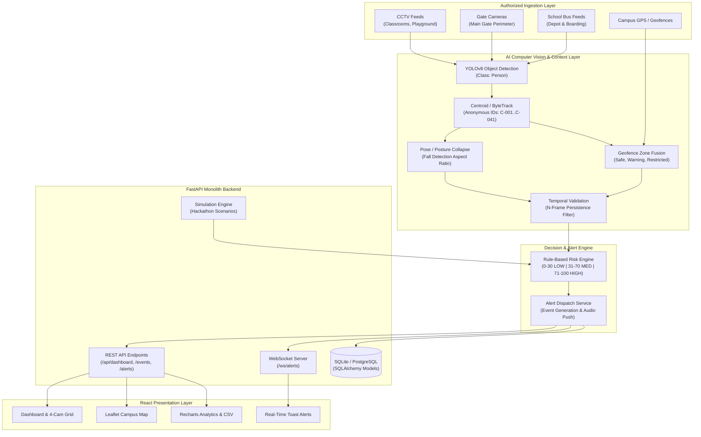
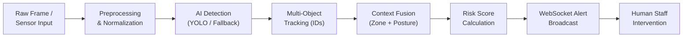

# ChildGuard AI — System Architecture & Design Specification

> **Tagline:** Detect. Assess. Alert. Protect.  
> **Stream:** PRISMTECH 2026 — Social Stream  
> **Domain:** AI-Powered Child Monitoring & Campus Safety Ecosystem

---

## 1. Executive Summary

ChildGuard AI is an AI-assisted early-warning and decision-support system for supervised campus environments (schools, event venues, exhibitions, school transportation). It receives authorized video, location, and geofencing feeds, detects anonymized child tokens (`C-001` .. `C-041`), tracks trajectories, validates events across temporal smoothing windows, computes multi-factor risk scores, and broadcasts instant real-time alerts to school administrators, security personnel, and parents.

---

## 2. High-Level System Architecture

---

## 3. Data Processing & Detection Pipeline

### 3.1 Detection & Tracking
- **Object Detection:** Identifies `person` entities using Ultralytics YOLOv8. If weights are missing, the system activates **AI Demo Mode** providing realistic synthetic bounding boxes.
- **Anonymous Tracking:** Assigns token IDs (`C-017`, `C-021`, etc.) via centroid distance association across consecutive frames.

### 3.2 Posture & Fall Detection
- Computes bounding box aspect ratio:
  $$\text{Aspect Ratio} = \frac{\text{Height}}{\text{Width}}$$
- Standing children typically exhibit an aspect ratio $> 1.6$. A rapid drop to $< 0.75$ indicates a sudden transition to a horizontal posture, triggering potential fall alerts.

### 3.3 Temporal Smoothing & Anti-False-Positive Filter
To prevent alerts triggered by brief single-frame noise:
- Events must persist across $N$ frames (default $N = 3$) within a 5-second window.
- A 15-second cooldown is enforced for duplicate alerts on the same token.

---

## 4. Transparent Risk Scoring Engine

The risk engine computes a transparent 0–100 integer score:

| Context / Event Type | Base Score | Zone Sensitivity Factor | Risk Band |
| :--- | :--- | :--- | :--- |
| **Zone Entry (Playground)** | 10 | $\times 1.0$ (Safe) | **LOW (Safe)** |
| **Loitering in Parking Area** | 40 | $\times 1.1$ (Warning) | **MEDIUM (Attention)** |
| **Restricted Zone Breach (Gate)** | 85 | $\times 1.3$ (Restricted) | **HIGH (Immediate Attention)** |
| **Sudden Fall Detected** | 90 | $\times 1.1$ (Any zone) | **HIGH (Immediate Attention)** |
| **School Bus Child Left Behind** | 100 | $\times 1.2$ (Vehicle) | **HIGH (Immediate Attention)** |

- **Score $\le 30$:** `LOW` (Green)
- **Score $31 - 70$:** `MEDIUM` (Amber)
- **Score $\ge 71$:** `HIGH` (Red)

---

## 5. Privacy by Design Specification

1. **Zero Biometrics:** No facial recognition algorithms, feature embeddings, or biometric templates are stored.
2. **Anonymous Identification:** All individuals are labeled using ephemeral session tokens (`C-001` .. `C-041`).
3. **Role-Based Scope:**
   - **Admin:** Full system configuration, sensor provisioning, and audit logs.
   - **Teacher:** Zone status, classroom attendance telemetry.
   - **Security:** Monitoring camera wall, high-risk alert verification.
   - **Parent:** Designated child safety check-in and alert notifications.
4. **Mandatory Disclaimer:** *"AI-assisted safety monitoring. Human supervision remains essential."*
